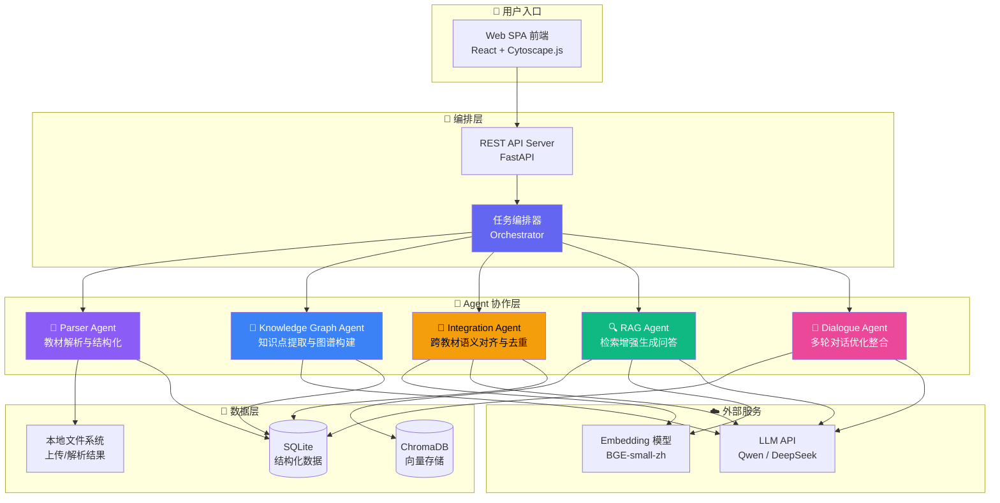
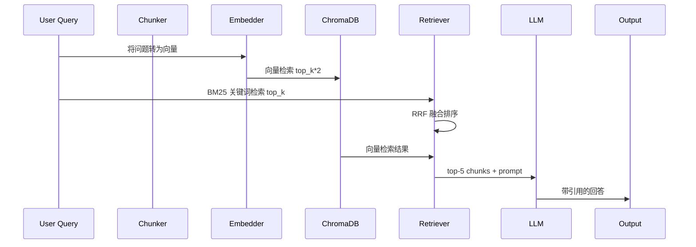
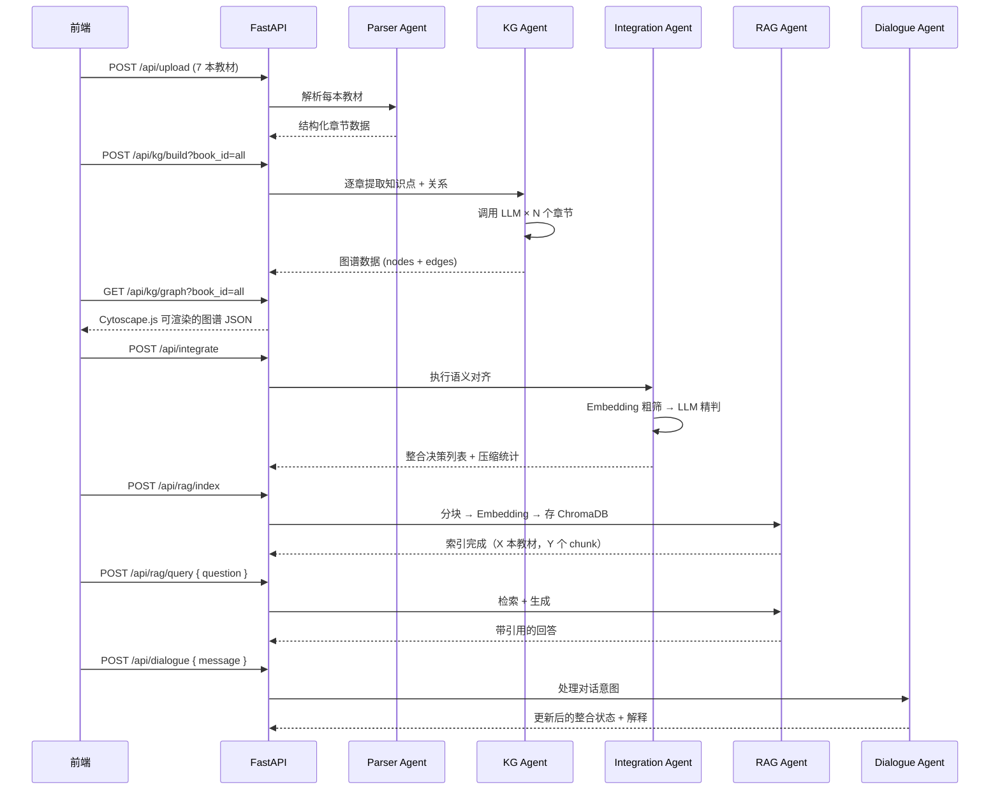

# Math Agent — Agent 架构设计文档

## 架构总览

本系统采用 **5-Agent 协作架构**，每个 Agent 职责边界清晰、输入输出标准化，通过编排器（Orchestrator）串联完整流水线。

---

## 各 Agent 详细定义

### 1. Parser Agent — 教材解析与结构化

| 属性 | 说明 |
|------|------|
| **职责** | 多格式文件解析、章节识别、页码映射、统一结构化 |
| **输入** | `FileUpload { filename, content(bytes), format(pdf|md|txt|docx) }` |
| **输出** | `TextbookDoc { textbook_id, title, chapters: [{ chapter_id, title, page_start, page_end, content, char_count }], metadata: { total_pages, total_chars, format } }` |

**处理流程：**
1. PDF → `PyMuPDF` 逐页解析，提取文本 + 字体大小
2. 章节标题识别：正则 `第[一二三四五六七八九十\d]+章` + 字体判断
3. 页眉页脚过滤（位置 + 重复模式）
4. 输出结构化 JSON，存入 SQLite

---

### 2. Knowledge Graph Agent — 知识点提取与图谱构建

| 属性 | 说明 |
|------|------|
| **职责** | 逐章调用 LLM 提取知识点 + 关系，构建知识图谱 |
| **输入** | `{ textbook_id, chapter: { chapter_id, title, content } }` |
| **输出** | `{ nodes: [{ id, name, definition, category, chapter, page }], edges: [{ source, target, relation_type(prerequisite|parallel|contains|applies_to), description }] }` |

**LLM Prompt 策略：**
- 每次仅处理一个章节（避免上下文溢出）
- 要求输出 JSON 格式，给出 few-shot 示例
- 关系类型必须包含：前置依赖、并列关系、包含关系、应用关系

**前端可视化：** Cytoscape.js 力导向图
- 节点大小按频次缩放
- 颜色按教材来源区分
- 支持点击展开详情、搜索高亮、缩放拖拽

---

### 3. Integration Agent — 跨教材语义对齐与去重（核心）

| 属性 | 说明 |
|------|------|
| **职责** | 语义对齐识别重复知识点，执行合并/保留/删除决策 |
| **输入** | `{ textbooks: [KnowledgeGraph], threshold: 0.85, target_compression: 0.3 }` |
| **输出** | `{ decisions: [{ action(merge|keep|remove), affected_nodes, result_node, reason, confidence }], stats: { original_chars, merged_chars, compression_ratio } }` |

**对齐算法（两阶段）：**
1. **Embedding 粗筛**：BGE-small-zh 编码所有节点名 → 余弦相似度矩阵 → 阈值 0.85 初筛候选对
2. **LLM 精判**：将候选对送给 LLM 做最终等价性判断（更准确）

**决策逻辑：**
- `merge`：多本教材讲同一概念 → 保留描述最完整版本，标注多源引用
- `keep`：仅一本教材涉及 → 保留
- `remove`：低于字数阈值的碎片节点 → 删除

---

### 4. RAG Agent — 检索增强生成问答

| 属性 | 说明 |
|------|------|
| **职责** | 分块 → Embedding → 检索 → 生成带引用的回答 |
| **输入** | `{ query: string, top_k: 5, use_hybrid: boolean }` |
| **输出** | `{ answer: string, citations: [{ textbook, chapter, page, relevance_score }], source_chunks: [string] }` |

**Pipeline：**

**分块策略：**
- 每块 600 字，相邻重叠 80 字（sliding window）
- 保留元数据：教材名、章节标题、起始页码

**Prompt 约束：**
- 仅基于提供的上下文回答
- 每个回答附带 `[教材名, 第 X 章, 第 X 页]` 引用
- 找不到答案时说「当前知识库中未找到相关信息」

---

### 5. Dialogue Agent — 多轮对话优化整合

| 属性 | 说明 |
|------|------|
| **职责** | 与用户（教师）多轮对话，根据反馈修改整合决策 |
| **输入** | `{ conversation_history, current_integration_state }` |
| **输出** | `{ updated_decisions, explanation }` |

**支持的对话场景：**
- 「为什么把 A 和 B 合并了？」→ 解释决策理由
- 「请保留 C」→ 将 remove 改为 keep
- 「把 X 和 Y 分开」→ 将 merge 拆分
- 对话历史持久化在会话中

---

## 设计决策论证

### 为什么采用多 Agent 架构？

| 考量 | 单 Agent | 多 Agent（本方案） |
|------|----------|-------------------|
| Prompt 复杂度 | 需要把所有能力塞进一个超长 prompt | 每个 Agent 有聚焦的 prompt |
| 错误隔离 | 一处失误可能污染全流程 | Agent 间输出格式约束，出错不扩散 |
| 可迭代性 | 改一个环节要改整个 prompt | 独立优化各 Agent 的 prompt 和参数 |
| 上下文长度 | 解析 + 提取 + 整合挤在一次调用 | 各自独立调用，每次上下文可控 |
| 可观测性 | 黑盒 | 每个 Agent 的 I/O 可单独日志记录 |

### 为什么是 5 个而不是更多？

- 5 个 Agent 恰好覆盖 P0 全部功能，无冗余
- 每个 Agent 职责单向传递，无循环依赖
- 编排器做薄（只负责调度），Agent 做厚（各自闭环）

---

## 数据流与调用链路

一次完整的「上传 → 构建图谱 → 整合 → 问答」流程：

---

## 技术选型

| 层面 | 技术 | 理由 |
|------|------|------|
| 前端 | React 19 + Vite + Tailwind CSS | 和你现有技能栈一致 |
| 图谱可视化 | Cytoscape.js | 比 D3.js 更开箱即用，专为图数据设计 |
| 后端 | FastAPI (Python) | 异步支持好，自动生成 API 文档 |
| PDF 解析 | PyMuPDF (fitz) | 轻量，中文支持好，能提取字体大小 |
| 向量数据库 | ChromaDB | 轻量嵌入式，无需额外部署 |
| Embedding | BGE-small-zh (sentence-transformers) | 专为中文优化，本地运行免费 |
| LLM | DashScope Qwen / DeepSeek | 支撑跨学科推理，你已有 Key |
| 数据库 | SQLite | 零配置，适合单机部署 |

---

## 已知局限与改进方向

- **PDF 解析精度**：扫描版 PDF 需 OCR（Tesseract/PaddleOCR），当前仅支持文字版 PDF
- **图谱规模**：7 本教材约 5000+ 节点，力导向图在浏览器渲染可能卡顿，需做虚拟化
- **LLM 调用成本**：逐章提取需要 ~200+ 次 LLM 调用，需做好并发和缓存
- **对齐精度**：Embedding + LLM 两阶段已是最佳实践，但阈值需根据实际数据调优
