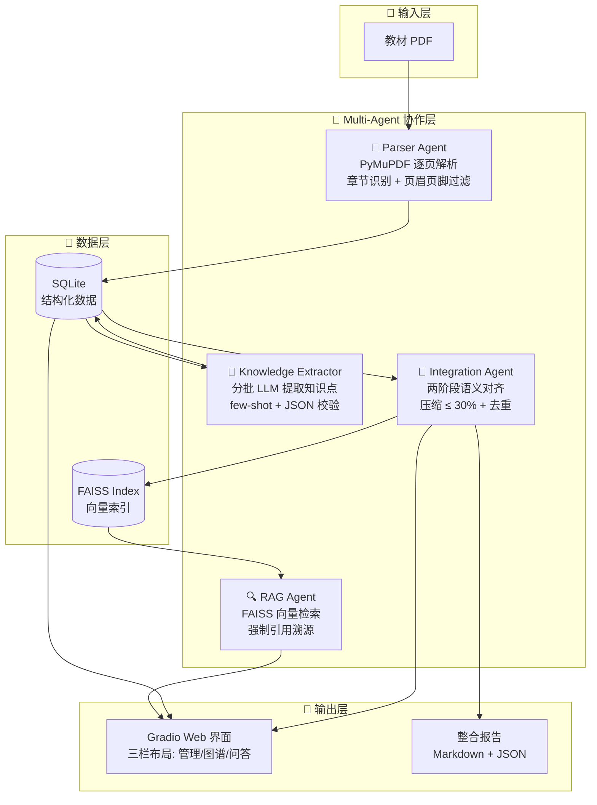
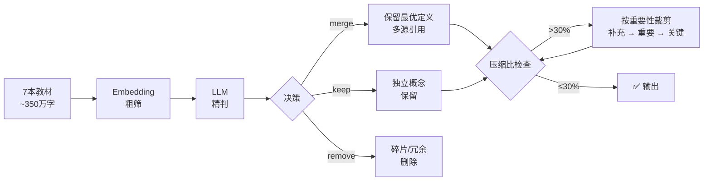

# 🧠 学科知识整合智能体

> AI 全栈黑客松参赛项目 — 5 个 AI Agent 协作，把 7 本教材变成不到 30% 的精华，教学效果不打折。

## 项目架构



## 核心创新

### 1. 30% 压缩比的实现



**关键技术决策：**
- **两阶段对齐**：Embedding (BGE-small-zh) 在 O(n²) 层面快速筛候选对，LLM 仅对候选对做精确判断，平衡了精度和成本
- **重要性三级分类**：关键（基石概念）→ 重要（主干知识）→ 补充（拓展知识），压缩时从低优先级裁剪，保证教学连续性
- **定义择优保留**：merge 时选择定义最完整、描述最准确的版本，而非简单拼接

### 2. RAG 引用精准度保证

| 环节 | 机制 |
|------|------|
| **分块** | 600 字/块 + 80 字重叠，优先在句号处断，确保知识单元完整性 |
| **元数据绑定** | 每块强制绑定 `[教材名称, 章节, 页码]`，不可丢失 |
| **检索去重** | 同教材同章节的重复块自动去重，保证 top-k 多样性 |
| **Prompt 约束** | 系统提示明确要求「仅使用参考资料」「每个陈述标注引用」 |
| **引用格式** | 固定 `[教材名称, 第X章, 第X页]`，可追溯至原始页码 |

## 项目结构

```
knowledge-agent/
├── main.py                 # 一键启动入口
├── run_pipeline.py         # 端到端测试脚本
├── src/
│   ├── backend/
│   │   ├── agents/
│   │   │   ├── parser.py              # Parser Agent
│   │   │   ├── knowledge_extractor.py # Knowledge Extractor
│   │   │   ├── integrator.py          # Integration Agent
│   │   │   ├── rag.py                 # RAG Agent (FAISS)
│   │   │   └── dialogue.py            # Dialogue Agent
│   │   ├── models/schemas.py          # Pydantic 数据模型
│   │   └── routers/api.py             # REST API
│   └── frontend/
│       └── app.py                     # Gradio 界面
├── docs/                              # 开发文档
├── report/                            # 整合报告
├── data/textbooks/                    # 教材 PDF（不上传 Git）
├── requirements.txt
└── .env
```

## 安装运行

### 1. 环境依赖

- Python 3.10+
- 7 本医学教材 PDF（存放于 `data/textbooks/`）

### 2. 安装

```bash
git clone <repo-url>
cd knowledge-agent
python -m venv .venv
source .venv/bin/activate
pip install -r requirements.txt
```

### 3. 配置

编辑 `.env` 文件，填入 API Key：

```env
DASHSCOPE_API_KEY=sk-your-key-here
LLM_MODEL=qwen-max
EMBEDDING_MODEL=BAAI/bge-small-zh-v1.5
```

### 4. 启动

```bash
# 方式一：一键全流程 + Gradio 界面
python main.py pipeline --ui

# 方式二：单步执行（调试用）
python run_pipeline.py --books 1

# 方式三：仅启动界面
python main.py ui
```

浏览器打开 `http://localhost:7860`

## API 接口

| 端点 | 方法 | 说明 |
|------|------|------|
| `/api/upload` | POST | 上传教材文件 |
| `/api/kg/build` | POST | 构建知识图谱 |
| `/api/kg/graph` | GET | 获取图谱数据 |
| `/api/integrate` | POST | 跨教材整合 |
| `/api/rag/index` | POST | 构建 FAISS 索引 |
| `/api/rag/query` | POST | RAG 问答 |
| `/api/dialogue` | POST | 多轮对话 |

## License

MIT
