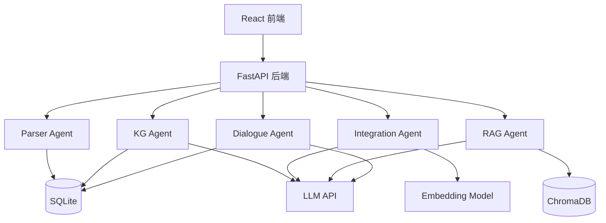

# 系统设计

## 架构图

## 数据流

1. 上传 → Parser → 结构化章节 → SQLite
2. 图谱构建 → KG Agent 逐章调用 LLM → 节点/边 → SQLite
3. 整合 → Integration Agent 语义对齐 → 决策列表
4. 问答 → RAG Agent 分块/Embedding/检索/生成 → 带引用回答
5. 对话 → Dialogue Agent 理解意图 → 调整整合结果

## 技术选型及理由

| 组件 | 选择 | 理由 |
|------|------|------|
| 前端框架 | React 19 + Vite | 已有开发经验 |
| 图谱可视化 | Cytoscape.js | 专为图数据设计，开箱即用 |
| 后端框架 | FastAPI | 异步原生，自动 OpenAPI 文档 |
| PDF 解析 | PyMuPDF | 中文支持好 |
| 向量存储 | ChromaDB | 嵌入式轻量，无需外部服务 |
| Embedding | BGE-small-zh | 中文 SOTA，本地运行 |
| LLM | Qwen-Max (DashScope) | 已有 API Key |

## API 接口一览

见 `src/backend/routers/api.py`
